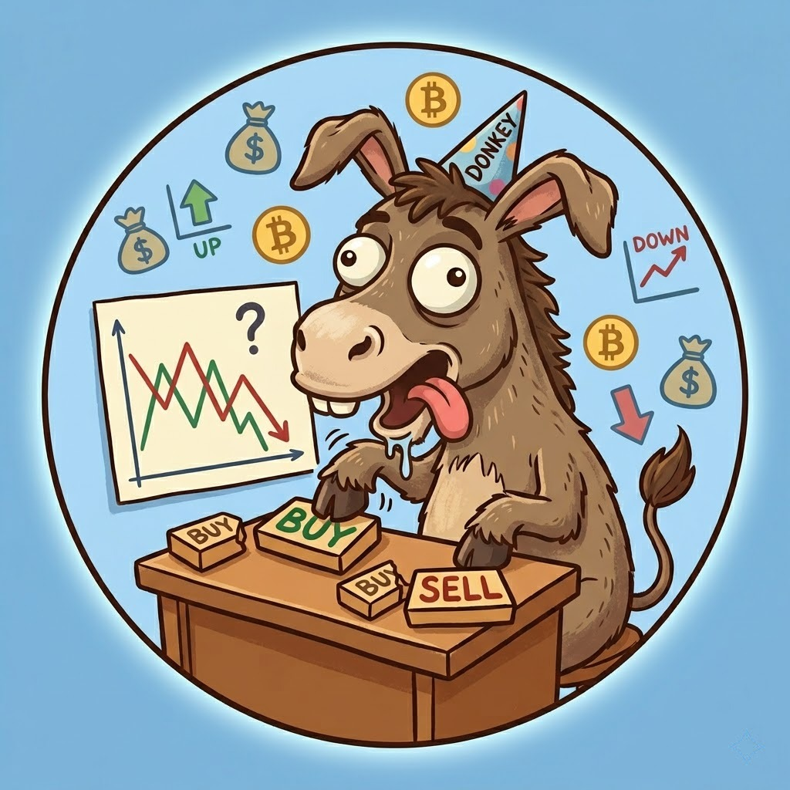

# 🫏 Quant for Donkey

> **Hệ thống Quản lý Quỹ AI Quant chuyên nghiệp dành cho những chú Lừa kiên trì — Tích hợp Order Flow, 6 chiến lược "thực chiến", tự học và Dashboard 2 chế độ.**

<p align="center">
  
</p>


---

## 📊 Performance Targets (Donkey Proof)

| Metric | Current | Target |
|--------|---------|--------|
| **Profit Factor** | 1.72 | > 1.5 |
| **Sharpe Ratio** | 3.65 | > 1.5 |
| **Win Rate** | 45% - 87% | > 45% |
| **Max Drawdown** | 4.2% | < 15% |
| **Execution** | Realistic | Slippage & Spread |

---

## 🎯 Tổng quan

**Quant for Donkey (QFD)** là một cỗ máy giao dịch định lượng toàn diện, được thiết kế để phục vụ cả hai đối tượng:
1. **Donkey (Người mới)**: Cần quyết định MUA/GIỮ đơn giản, xác suất thắng cao.
2. **Quant (Chuyên gia)**: Cần dữ liệu Order Flow, Funding, Liquidations và Portfolio Management chuyên sâu.

---

## ✨ Tính năng "Khủng" (v4.3.5)

### 🌓 Dashboard 2 Chế độ (Donkey vs Quant)
- **🫏 Donkey View**: Chỉ hiển thị thông tin tối giản - **NÊN MUA HAY KHÔNG?**, xác suất thắng, lợi nhuận kỳ vọng. Cực kỳ dễ hiểu.
- **📊 Quant View**: 8 tab phân tích chuyên sâu với đầy đủ thông số kỹ thuật, mô hình ML và dữ liệu dòng tiền.

### 🌊 Order Flow & Smart Money (NEW!)
- **CVD (Cumulative Volume Delta)**: Theo dõi áp lực mua/bán tích lũy trên từng mức giá.
- **Absorption Detection**: Phát hiện các vùng hấp thụ của Smart Money.
- **Delta Divergence**: Cảnh báo khi giá và dòng tiền mâu thuẫn.

### 🤖 AI XGBoost Auto-Retraining
- **Drift Detection**: Tự động phát hiện khi mô hình dự báo bị "lệch" so với thực tế.
- **Auto-Retrain**: Tự động huấn luyện lại model mỗi tuần hoặc khi sai số vượt ngưỡng.
- **Model Versioning**: Lưu trữ và cho phép rollback các phiên bản model.

### 💼 Portfolio Rebalancing
- **Dynamic Rebalancing**: Tự động tính toán lệnh cân bằng lại tỷ trọng khi lệch > 5%.
- **Portfolio Rotation**: Tự động chuyển đổi tài sản dựa trên Market Regime (Bull/Bear).
- **Tax-loss Harvesting**: Gợi ý chốt lỗ thông minh để tối ưu hóa thuế.

### 🔔 Real-time Alerts
- **Telegram & Discord**: Nhận thông báo tức thời về cơ hội DCA, tín hiệu Order Flow, hoặc khi hệ thống tự động retrain model.

---

## 📈 6 Chiến lược Chủ chốt

| Chiến lược | Đặc điểm | Phù hợp với |
|----------|--------|----------|
| **EMA Crossover 9/21** | Bắt trend sớm | Bull Market |
| **ATR Breakout 2.0x** | Chặn lỗ thông minh | Volatile Market |
| **Bollinger Bands Squeeze** | Chờ đợi bùng nổ | Consolidation |
| **Grid Trading** | Thu hoạch biến động | Sideways Market |
| **Regime Adaptive** | Tự động đổi bài | Toàn bộ thị trường |
| **Multi-Strategy Ensemble** | Bỏ phiếu đa số | Sự an toàn tuyệt đối |

---

## 🏗️ Kiến trúc QFD Engine

```
┌──────────────────────────────────────────────────────────────────────┐
│                     Donkey Discovery Layer (TradingView)             │
│  Auto-Discovery → Pine Converter → Backtest → Rank & Select         │
└──────────────────────────────────────────────────────────────────────┘
                               ↓
┌──────────────────────────────────────────────────────────────────────┐
│                        Data Collection Layer                          │
│  Order Flow (CVD) │ Funding Rate │ Liquidations │ Real-time Price     │
└──────────────────────────────────────────────────────────────────────┘
                               ↓
┌──────────────────────────────────────────────────────────────────────┐
│                    Intelligence & Decision Engine                     │
│  XGBoost Forecast (Auto-Retrain) │ Veto Mechanism │ AI Brain (LLM)   │
└──────────────────────────────────────────────────────────────────────┘
```

---

## 🚀 Cài đặt

```bash
# Clone repo
git clone https://github.com/baok1210/Quant-For-Donkey.git
cd Quant-For-Donkey

# Tạo virtual environment & cài dependencies
python -m venv venv
source venv/bin/activate # Linux/Mac
pip install -r requirements.txt

# Cài đặt API keys trong .env
cp .env.example .env
```

---

## 📁 Cấu trúc thư mục mới

- `main.py`: Chạy phân tích hàng ngày (CLI).
- `dashboard.py`: Giao diện Dashboard 2 chế độ (Streamlit).
- `engine/order_flow.py`: Phân tích CVD & Hấp thụ.
- `engine/forecaster.py`: Dự báo giá với cơ chế Auto-Retrain.
- `engine/portfolio_manager.py`: Quản lý danh mục & Rebalancing.
- `engine/alert_system.py`: Cảnh báo Telegram/Discord.
- `engine/strategies/`: Bộ 6 chiến lược cốt lõi.

---

## 📊 Lịch sử phát triển (Chuyên nghiệp)

- **v4.3.5**: Tích hợp QFD Logo và hoàn thiện UI Dashboard 2 chế độ.
- **v4.3.4**: Chia Dashboard thành **Donkey View** (Simple) và **Quant View** (Expert).
- **v4.3.3**: Tích hợp **Real-time Alert System** (Telegram/Discord).
- **v4.3.2**: Triển khai **Portfolio Rebalancing** và **Dynamic Rotation**.
- **v4.3.1**: Nâng cấp **XGBoost với Auto-Retraining** và **Order Flow Analysis**.
- **v4.3.0**: Sửa lỗi Sharpe logic, Liquidation zones thực tế và thêm **Veto Mechanism**.

---

## ⚠️ Disclaimer

Đây là công cụ hỗ trợ quyết định, **không phải lời khuyên đầu tư**. Hãy giao dịch có trách nhiệm.

---

## 📄 License

MIT License

---

**Được xây dựng bởi ❤️ bởi OpenClaw AI cho Quant for Donkey**

*Version 4.3.5 | 2026-04-13 | 40+ Modules | Production Ready*
